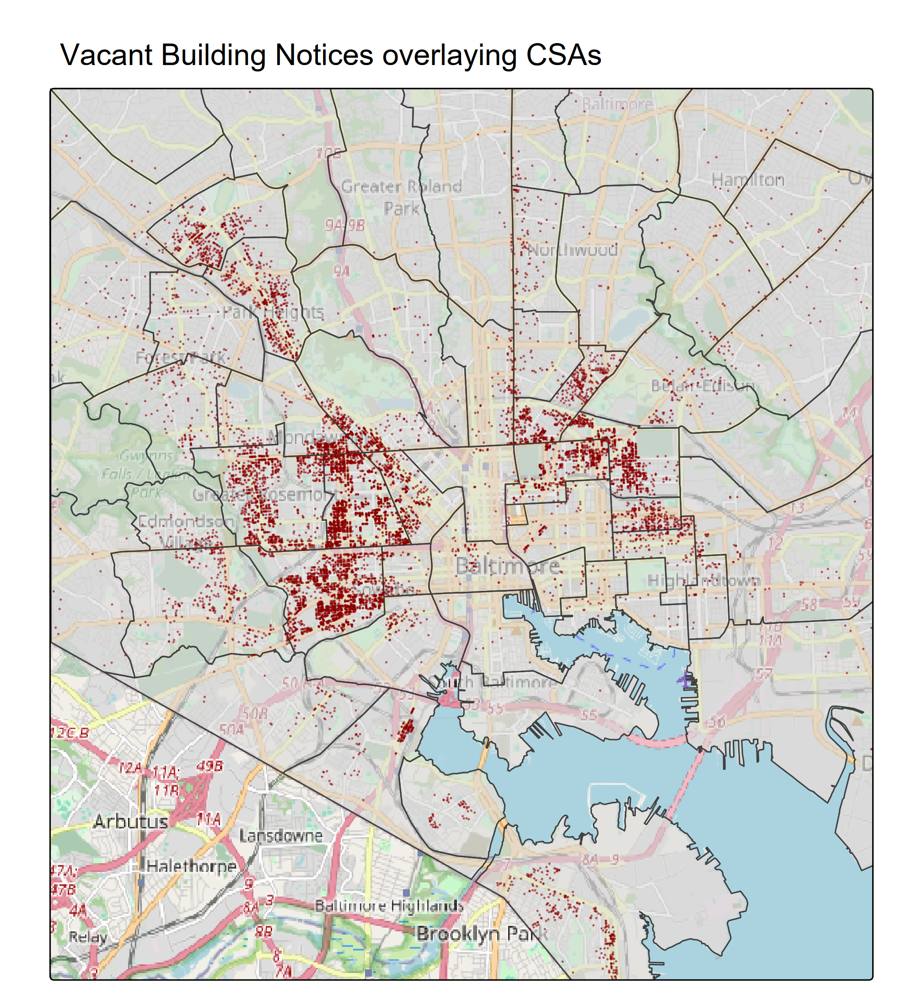
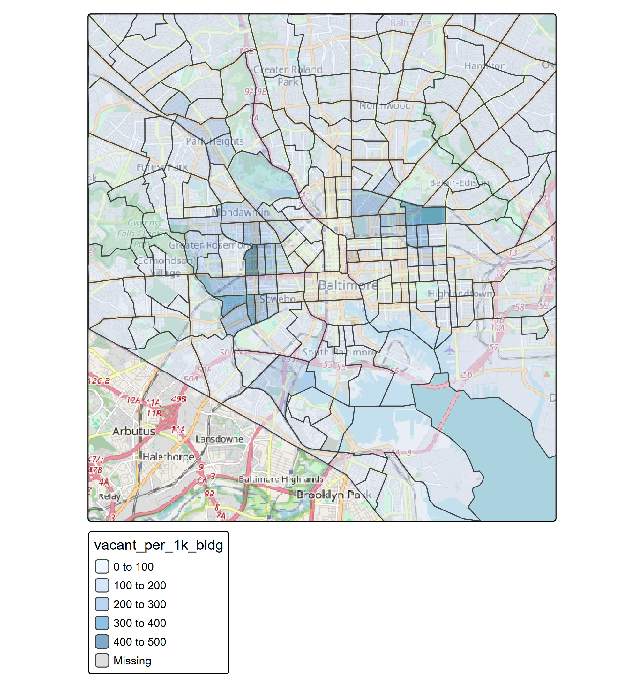
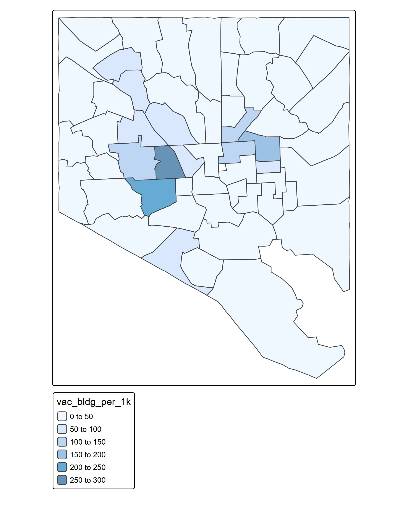

# Vacant Building Notices and Baltimore Area Survey Data

Developed by TJ Butler

## Vacant Building Notices (VBNs)

Baltimore City Department of Housing and Community Development shares a list of properties within Baltimore City that have received a Vacant Building Notice. Data can be found here:
[DHCD VBN Notices](https://data.baltimorecity.gov/datasets/baltimore::vacant-building-notices/explore?location=39.296438%2C-76.620458%2C10)

The ESRI visualization of this map on Open Baltimore uses a pretty big dot to represent the VBNs.

To help visualize the density, I shrunk the dots and reduced the 'alpha' or made them more translucent. This helps us visualize where there are hotspots without overwhelming the map.

We can definitely see that some geographies have much higher VBN's than others.

One way of looking at this as recommended by a colleague is to view VBN's per 1k buildings. To get that number by CSA and Census Tract I used American Community Survey data, 5 year estimates, of total buildings by Census Tract in table [B25001](https://data.census.gov/table/ACSDT1Y2024.B25001?q=B25001)

## Baltimore Area Survey
The Baltimore Area Survey is managed by the Johns Hopkins 21st Century Cities Initiative. For more, see their [website](https://21cc.jhu.edu/baltimore-area-survey/).

I wanted to focus in on 2 questions on the Baltimore Area Survey related to vacants: sentiments around vacant buildings and sentiments arouns vacant lots.

